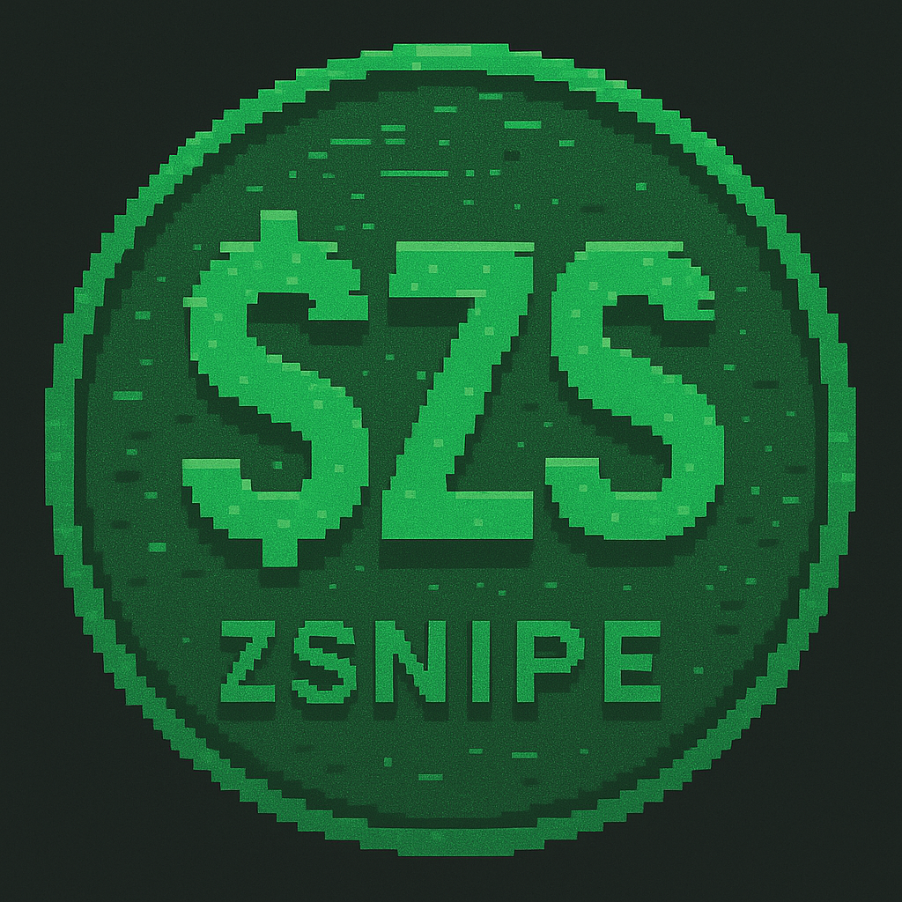

# Zsnipe



Welcome to **Zsnipe**, a cutting-edge platform designed to help users snipe the best trades on the Solana blockchain. With lightning-fast swaps, real-time token insights, and a cyberpunk-inspired interface, Zsnipe empowers users to stay ahead in the fast-paced world of decentralized finance (DeFi). Whether you're a seasoned trader or just getting started, Zsnipe provides the tools you need to maximize your trading efficiency on Solana. 🚀

## 📖 Overview

Zsnipe is a web application built to streamline trading on Solana. It offers features like manual and automated swaps, real-time trending token data, user profile customization, and an airdrop program to reward active users with $ZS tokens. The platform’s sleek, cyberpunk-themed design creates an immersive experience, making trading both functional and visually engaging.

### Key Features
- **Fast Swaps**: Execute buy and sell orders on Solana with minimal slippage and high reliability.
- **Trending Tokens**: Access real-time data on Solana’s hottest tokens, including price, volume, and market cap trends.
- **Auto Sniper**: Automate your trading with customizable filters for market cap, protocols, and token names.
- **User Profiles**: Personalize your experience with profile photos, usernames, and social links, while tracking your trading stats.
- **$ZS Airdrop Program**: Earn $ZS tokens by participating in swaps, with rewards distributed every 30 days based on your activity.

## 🌐 Supported Protocols
Zsnipe supports swaps and token tracking across multiple Solana protocols:
- Pumpfun AMM ✔️
- Pumpfun V1 ✔️
- Believeapp ✔️
- Raydium ✔️
- Meteora ✔️

## 🛠️ Getting Started

Follow these steps to set up and run Zsnipe locally on your machine.

### Prerequisites
Before you begin, ensure you have the following installed:
- **Python 3.8+**: Required to run the backend server.
- **pip**: Python package manager for installing dependencies.
- **A Solana Wallet**: A browser extension wallet like Phantom is recommended for interacting with the platform.
- **Git**: To clone the repository.
- **A Modern Web Browser**: For accessing the web interface (e.g., Chrome, Firefox).

Optionally, you may need:
- **Node.js and npm**: If you plan to add frontend dependencies or run additional scripts (not required for the core setup).
- **A Code Editor**: Such as VS Code, for making changes to the project.

### Installation
1. **Clone the Repository**:
   Clone the Zsnipe repository to your local machine using Git:
   ```bash
   git clone https://github.com/zsnipe/zsnipe.git
   cd zsnipe